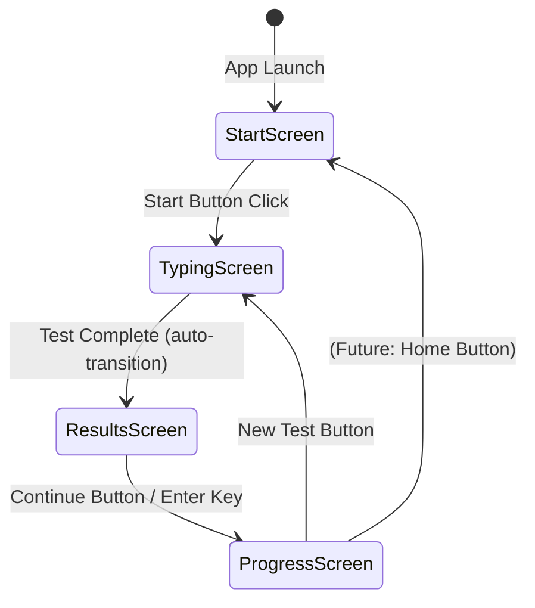

# Architecture Documentation

**Version**: v2.0.0  
**Last Updated**: 2025  
**Status**: Active Development

---

## Overview

This document describes the architecture of the Typing Test application, focusing on the GUI implementation introduced in v2.0.0. The application follows a strict separation of concerns between core logic (`engine.py`) and presentation layers (`main.py` for terminal, `gui.py` for GUI).

---

## Screen Architecture

The GUI application uses a **screen-based architecture** with four distinct screens managed by a central controller.

### Screen Components

#### 1. `StartScreen` (`gui.py`, lines 74-95)

**Purpose**: Welcome screen and application entry point.

**Responsibilities**:
- Display application title
- Provide "Start" button to begin typing test
- Initialize user session flow

**UI Elements**:
- Title label: "Typing Test"
- Start button (triggers `app.show_typing()`)

**Lifecycle**:
- Created once during `TypingTest.__init__()`
- Shown on application launch
- Hidden when transitioning to typing screen

---

#### 2. `TypingScreen` (`gui.py`, lines 98-183)

**Purpose**: Active typing test interface with real-time feedback.

**Responsibilities**:
- Display target text with per-character color coding
- Handle keyboard input events
- Update live WPM calculation
- Manage typing session lifecycle
- Transition to results screen on completion

**UI Elements**:
- Title: "Type the text below"
- Text display widget (`tk.Text`) with character-level coloring:
  - Green: correct characters
  - Red: incorrect characters
  - Gray: untyped characters
- Live WPM stat label (updates every 500ms)

**Key Methods**:
- `start_test()`: Creates new session via `engine.create_session()`
- `on_key_press()`: Processes keystrokes through `engine.process_key()`
- `update_display()`: Renders character states via `engine.build_char_states()`
- `update_wpm()`: Polls `engine.calculate_wpm()` every 500ms

**Event Handling**:
- Binds `<Key>` events when shown
- Unbinds when hidden to prevent input leakage
- Converts Tkinter key events to engine-compatible format

**Session Management**:
- Owns `self.session` dictionary (created by engine)
- Saves session via `engine.save_session()` on completion
- Passes session to results screen on transition

---

#### 3. `ResultsScreen` (`gui.py`, lines 185-238)

**Purpose**: Display comprehensive test results and performance feedback.

**Responsibilities**:
- Show final WPM and accuracy
- Display performance profile classification
- Show typing consistency analysis
- List weak keys (most frequently mistyped characters)
- Display average key delay
- Provide actionable improvement tip
- Transition to progress screen

**UI Elements**:
- Title: "Performance Feedback"
- Multi-line text label displaying:
  - WPM
  - Accuracy percentage
  - Performance profile
  - Typing consistency
  - Weak keys list
  - Average key delay
  - Actionable tip
- Continue button (triggers `app.show_progress()`)

**Key Methods**:
- `load_session(session)`: Populates display with session data
- Uses multiple engine analytics functions:
  - `engine.calculate_wpm()`
  - `engine.calculate_accuracy()`
  - `engine.get_performance_profile()`
  - `engine.get_speed_feedback()`
  - `engine.get_weak_keys()`
  - `engine.get_average_key_delay()`
  - `engine.get_actionable_tip()`

**Navigation**:
- Continue button → Progress screen
- Enter key → Progress screen (keyboard shortcut)

---

#### 4. `ProgressScreen` (`gui.py`, lines 240-275)

**Purpose**: Display long-term progress statistics across all sessions.

**Responsibilities**:
- Show aggregate statistics from `sessions.json`
- Display total tests completed
- Show best WPM achieved
- Display average WPM and accuracy
- Provide "New Test" action to restart flow

**UI Elements**:
- Title: "Your Progress"
- Multi-line stats label:
  - Total Tests
  - Best WPM
  - Average WPM
  - Average Accuracy
- New Test button (triggers `app.show_typing()`)

**Key Methods**:
- `refresh()`: Loads latest stats via `engine.get_progress_stats()`
- Called automatically when screen is shown

**Data Source**:
- Reads from `sessions.json` via `engine.get_progress_stats()`
- Handles empty state ("No data yet.")

---

### Controller: `TypingTest` (`gui.py`, lines 21-72)

**Purpose**: Central application controller managing screen lifecycle and navigation.

**Responsibilities**:
- Own the main application window (`ctk.CTk`)
- Create and manage all screen instances
- Coordinate screen transitions
- Implement show/hide pattern for screen switching

**Architecture Pattern**: **Controller Pattern**

**Key Methods**:
- `show_start()`: Transition to start screen
- `show_typing()`: Transition to typing screen (creates new session)
- `show_results(session)`: Transition to results screen with session data
- `show_progress()`: Transition to progress screen (refreshes stats)
- `_hide_all()`: Utility to hide all screens before showing new one

**Screen Management**:
- All screens created once during `__init__()`
- Screens use `pack()`/`pack_forget()` for show/hide
- Only one screen visible at a time

---

## State Flow

### Navigation Flow Diagram



### State Transition Details

#### 1. Application Launch → Start Screen
- **Trigger**: `TypingTest()` instantiation
- **Action**: `show_start()` called in `__init__()`
- **Result**: Start screen displayed, start button focused

#### 2. Start Screen → Typing Screen
- **Trigger**: Start button click
- **Action**: `show_typing()` called
- **Process**:
  1. `_hide_all()` hides all screens
  2. `typing_screen.start_test()` creates new session
  3. `typing_screen.show()` displays screen and binds keyboard events
- **Result**: Active typing test ready for input

#### 3. Typing Screen → Results Screen
- **Trigger**: Test completion (`session["finished"] == True`)
- **Action**: `show_results(session)` called automatically
- **Process**:
  1. `engine.save_session(session)` saves to `sessions.json`
  2. `_hide_all()` hides typing screen
  3. `results_screen.load_session(session)` populates display
  4. `results_screen.show()` displays results and binds Enter key
- **Result**: Results screen displayed with session analytics

#### 4. Results Screen → Progress Screen
- **Trigger**: Continue button click OR Enter key press
- **Action**: `show_progress()` called
- **Process**:
  1. `_hide_all()` hides results screen
  2. `progress_screen.refresh()` loads latest stats
  3. `progress_screen.show()` displays progress screen
- **Result**: Progress screen displayed with aggregate statistics

#### 5. Progress Screen → Typing Screen
- **Trigger**: New Test button click
- **Action**: `show_typing()` called
- **Process**: Same as Start → Typing transition
- **Result**: New typing test session begins

**Note**: Progress screen does NOT return to Start screen. This is a deliberate UX decision (see deviations section).

---

## Engine ↔ GUI Responsibilities

### Strict Separation of Concerns

The architecture enforces a **one-way dependency**: GUI depends on Engine, Engine has zero knowledge of UI.

```
┌─────────────┐
│   gui.py    │  ← Presentation Layer
│             │     (UI rendering, events, navigation)
└──────┬──────┘
       │ imports
       ▼
┌─────────────┐
│ engine.py   │  ← Logic Layer
│             │     (typing logic, analytics, persistence)
└─────────────┘
```

### Engine Responsibilities (`engine.py`)

**Core Logic**:
- Session creation and state management
- Keystroke processing (typing, backspace)
- WPM calculation
- Accuracy calculation
- Character state determination (correct/incorrect/untyped)

**Analytics**:
- Mistake tracking (per-character error frequency)
- Keystroke timing analysis
- Performance profile classification
- Weak key detection
- Typing consistency analysis
- Actionable tip generation

**Data Persistence**:
- Loading/saving sessions to `sessions.json`
- Progress statistics aggregation
- Session history management

**UI-Agnostic Design**:
- No imports of GUI libraries
- No print statements or display logic
- Pure functions and data structures
- Returns data, never renders

### GUI Responsibilities (`gui.py`)

**Presentation**:
- Window management (CustomTkinter)
- Screen rendering and layout
- Visual styling (colors, fonts, spacing)
- UI component creation and management

**Event Handling**:
- Keyboard input capture
- Button click handling
- Key binding/unbinding
- Event-to-engine conversion

**Navigation**:
- Screen transition coordination
- State flow management
- User flow orchestration

**Data Display**:
- Formatting engine output for display
- Rendering character states with colors
- Updating live statistics
- Presenting analytics in readable format

### Communication Contract

**GUI → Engine**:
- `engine.create_session()` → Returns session dict
- `engine.process_key(session, key)` → Modifies session in-place
- `engine.build_char_states(target, current)` → Returns list of (char, state) tuples
- `engine.calculate_wpm(session)` → Returns integer
- `engine.calculate_accuracy(session)` → Returns float
- `engine.save_session(session)` → Writes to `sessions.json`
- Analytics functions → Return formatted strings/lists

**Engine → GUI**:
- Session dictionary (mutable, modified in-place)
- Character state tuples: `(character: str, state: "correct"|"incorrect"|"untyped")`
- Numeric values (WPM, accuracy, delays)
- Analytics strings (profiles, tips, feedback)

**No Direct GUI → Engine Calls**:
- GUI never modifies engine data structures directly
- GUI never implements typing logic
- GUI never calculates WPM/accuracy independently
- GUI never writes to `sessions.json` directly

---

## Known Deviations from Terminal UX

The GUI version (`gui.py`) intentionally differs from the terminal version (`main.py`) in several ways. These are **design decisions**, not bugs.

### 1. Combined Results and Feedback Screens

**Terminal Flow**:
```
Typing → Results Screen → Feedback Screen → Progress Screen
```

**GUI Flow**:
```
Typing → Results Screen (combined) → Progress Screen
```

**Rationale**: 
- Terminal uses two separate screens (`show_results()` and `show_feedback_screen()`)
- GUI combines both into a single `ResultsScreen` showing all analytics at once
- Reduces navigation steps and provides immediate comprehensive feedback
- Better suited for GUI where scrolling/reading is easier than terminal

**Impact**: 
- Same data displayed, different presentation flow
- No functional difference in analytics or session data

---

### 2. Progress Screen Navigation

**Terminal Flow**:
```
Progress Screen → (any key) → Returns to main loop → Start Screen
```

**GUI Flow**:
```
Progress Screen → "New Test" → Typing Screen (skips Start Screen)
```

**Rationale**:
- Terminal requires explicit "any key" to continue, then shows start screen
- GUI provides direct "New Test" action that skips welcome screen
- Faster workflow for users running multiple tests
- Start screen is only shown on initial app launch

**Impact**:
- Slightly different user flow
- No impact on session data or analytics

---

### 3. Early Exit Handling

**Terminal**:
- Supports ESC key to quit test early (`quit_early` flag)
- ESC on start/progress screens exits application
- Graceful exit handling in main loop

**GUI**:
- No early exit during typing test (ESC not handled)
- Window close button (X) exits application
- No explicit quit-early functionality

**Rationale**:
- GUI window management handles exit via standard window controls
- ESC during typing could be added in future version
- Current focus is on completing tests, not early exits

**Impact**:
- Minor UX difference
- No impact on completed session data

---

### 4. Keyboard Input Handling

**Terminal**:
- Uses `curses` library with `stdscr.getkey()`
- Handles special keys explicitly (ESC, backspace)
- Non-blocking input with `nodelay(True)` for live updates

**GUI**:
- Uses Tkinter event binding (`<Key>` events)
- Converts Tkinter key events to engine format
- Event-driven (no polling loop)

**Rationale**:
- Different input paradigms (curses vs Tkinter)
- GUI event-driven model is more efficient
- Both ultimately call `engine.process_key()` with same data

**Impact**:
- Implementation difference only
- Identical session data and behavior

---

### 5. Display Update Frequency

**Terminal**:
- Continuous loop with `time.sleep(0.01)` for responsiveness
- WPM updates on every loop iteration (very frequent)

**GUI**:
- WPM updates every 500ms via `root.after(500, callback)`
- Character display updates on every keystroke
- Event-driven updates (no polling loop)

**Rationale**:
- GUI doesn't need sub-millisecond updates (human perception limit)
- 500ms provides smooth visual feedback without performance overhead
- Character display is instant (updates on keystroke)

**Impact**:
- Slightly less frequent WPM updates in GUI
- No impact on final calculations (both use same engine functions)

---

### 6. Session Saving Timing

**Terminal**:
- Saves session after test completion, before showing results
- Only saves if `session["finished"] == True` (not on early exit)

**GUI**:
- Saves session immediately when `session["finished"] == True`
- Same condition check (`if session["finished"]`)

**Rationale**:
- Identical behavior, different code location
- Both ensure session is saved before displaying results

**Impact**:
- No functional difference
- Identical `sessions.json` output

---

## Architectural Principles

### 1. Engine Stability

**Rule**: `engine.py` is treated as a **stable API** in v2.x releases.

**Implications**:
- No changes to function signatures
- No changes to session dictionary schema
- No changes to calculation logic
- No changes to `sessions.json` format

**Rationale**: 
- Terminal version (`main.py`) depends on engine
- Breaking changes would require updating both UIs
- v2.x focus is GUI migration, not logic changes

---

### 2. Session Data Compatibility

**Rule**: GUI and terminal must produce **identical** `sessions.json` entries.

**Verification**:
- Both use `engine.save_session()` (same function)
- Both use `engine.create_session()` (same session structure)
- Both use `engine.process_key()` (same logic)

**Rationale**:
- Users may switch between terminal and GUI
- Historical data must remain readable
- Analytics must be consistent across UIs

---

### 3. No Logic Duplication

**Rule**: GUI must never reimplement engine logic.

**Examples**:
- ✅ GUI calls `engine.calculate_wpm()` (correct)
- ❌ GUI calculates WPM independently (forbidden)
- ✅ GUI calls `engine.build_char_states()` (correct)
- ❌ GUI determines correct/incorrect states (forbidden)

**Rationale**:
- Single source of truth for all logic
- Ensures consistency between UIs
- Easier maintenance and bug fixes

---

### 4. Screen Independence

**Rule**: Screens are independent components with clear boundaries.

**Implications**:
- Screens don't directly reference other screens
- All communication goes through controller (`TypingTest`)
- Screens expose `show()`/`hide()` interface
- Screen state is encapsulated within screen class

**Rationale**:
- Easier to modify individual screens
- Clear separation of concerns
- Testable components
- Future extensibility

---

## Future Architecture Considerations

### Planned Enhancements (v2.x)

1. **Formal State Management**
   - Add `ScreenState` enum/constants
   - Explicit state tracking in controller
   - State transition validation

2. **Error Handling**
   - Handle missing `text.txt` gracefully
   - Handle corrupt `sessions.json` gracefully
   - User-friendly error messages

3. **Navigation Improvements**
   - Consistent back/home navigation
   - Keyboard shortcuts documentation
   - Breadcrumb or navigation hints

### Post-v2.x Considerations (v3.0+)

1. **Visual Analytics**
   - Charts and graphs for progress
   - Trend visualization
   - Session history table/list

2. **Practice Modes**
   - Weak key drills
   - Timed practice sessions
   - Custom text input

3. **Data Export**
   - CSV export
   - JSON export
   - Report generation

**Note**: These are future considerations and should not influence v2.x architecture decisions.

---

## File Structure Summary

```
typing-test/
├── engine.py          # Core logic (UI-agnostic)
├── gui.py             # GUI presentation layer
├── main.py            # Terminal presentation layer
├── sessions.json      # Persistent session storage
├── text.txt           # Target text pool
└── ARCHITECTURE.md    # This file
```

---

## Version History

- **v2.0.0**: Initial GUI implementation with screen-based architecture
- **v1.4.0**: Terminal version with persistent storage
- **v1.3.0**: Multi-screen terminal UX
- **v1.2.0**: Engine separation and analytics
- **v1.1.0**: Real-time feedback
- **v1.0.0**: Basic typing test

---

**Document Status**: Living document, updated as architecture evolves.
